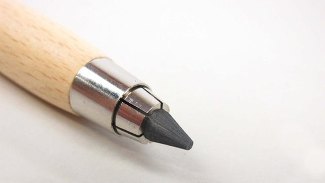
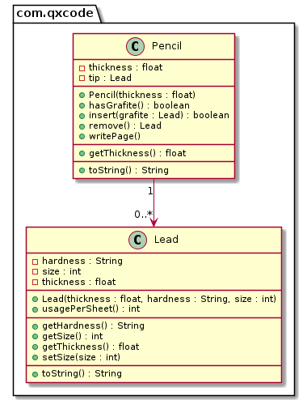

# Grafite & Lapiseira com um único grafite


[](Solver.java)

<!--TOC_BEGIN-->
- [Requisitos](#requisitos)
- [Shell](#shell)
- [Diagrama](#diagrama)
- [Esqueleto](#esqueleto)
- [Adaptações para C++](#adaptações-para-c)
<!--TOC_END-->

Faça o modelo de uma lapiseira que pode conter um único grafite.

## Requisitos
- Iniciar lapiseira
    - Inicia uma lapiseira de determinado calibre sem grafite no bico.
- Inserir grafite
    - Insere um grafite passando
        - o calibre: float.
        - a dureza: string.
        - o tamanho em mm: int.
    - Não deve aceitar um grafite de calibre não compatível.
- Remover grafite
    - Retira o grafite se houver algum.
- Escrever folha
    - Não é possível escrever se não há grafite ou o grafite tem tamanho menor ou igual a 10mm.
    - Quanto mais macio o grafite, mais rapidamente ele se acaba. Para simplificar, use a seguinte regra:
        - Grafite HB: 1mm por folha.
        - Grafite 2B: 2mm por folha.
        - Grafite 4B: 4mm por folha.
        - Grafite 6B: 6mm por folha.
        
    - O último centímetro de um grafite não pode ser aproveitado, quando o grafite estiver com 10mm, não é mais possível escrever.
    - Se não houver grafite suficiente para terminar a folha, avise que o texto ficou incompleto.


## Shell

```bash
#__case inserindo grafites
$init 0.5
$show
calibre: 0.5, grafite: null
$insert 0.7 2B 50
fail: calibre incompatível
$insert 0.5 2B 50
$show
calibre: 0.5, grafite: [0.5:2B:50]
$end
```

```bash
#__case inserindo e removendo
$init 0.3
$insert 0.3 2B 50
$show
calibre: 0.3, grafite: [0.3:2B:50]
$insert 0.3 4B 70
fail: ja existe grafite
$show
calibre: 0.3, grafite: [0.3:2B:50]
$remove
$insert 0.3 4B 70
$show
calibre: 0.3, grafite: [0.3:4B:70]
$end
```

```bash
#__case escrevendo 1
$init 0.9
$insert 0.9 4B 14
$write
$write
warning: grafite com tamanho insuficiente para escrever
$show
calibre: 0.9, grafite: [0.9:4B:10]
$remove
$show
calibre: 0.9, grafite: null
$insert 0.9 4B 16
$write
$show
calibre: 0.9, grafite: [0.9:4B:12]
$write
fail: folha incompleta
$show
calibre: 0.9, grafite: [0.9:4B:10]
$end
```


## Diagrama




***
